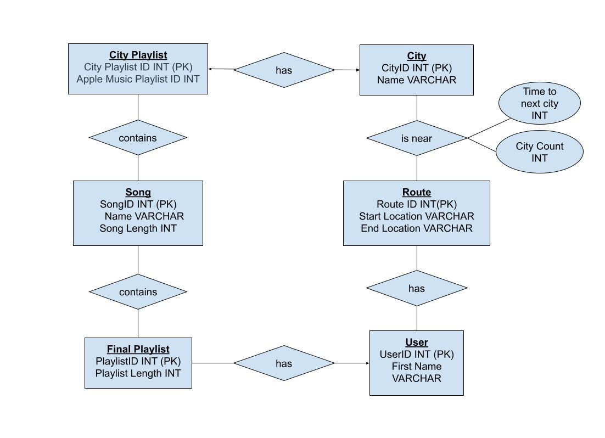

# Conceptual and Logical Database Design

## ER / UML Diagram

## Descriptions & Assumptions
__User__ - The user table will uniquely identify the user on the website. We will keep track of the name of the user to personalize their experience on the website.

A single user will be able to create many routes if they use the website for different trips and each route could have multiple users if many users are trying to go on the same trip.

__Route__ - The route table will uniquely identify the stops the users can go through.  We will keep track of the start & end location given by the user.

Each route could potentially go through multiple cities, and each city could be a part of multiple routes.  This relationship will also keep track of where in the city is in the route and how long a city will be close to the route.

__City__ - The city table will identify the specific city that is in the route.

Each city can be included in multiple routes, and routes can pass by multiple cities.

__City Playlist__ - The city playlist table will uniquely identify the playlist on Apple Music that provides the current top 25 songs in major cities.  We will need to keep track of the Apple Music ID given through an API to access the songs.

Each city playlist will contain multiple songs, and songs could be a part of multiple city playlists.

__Song__ - The song table will uniquely identify each song read in from Apple Music.  We will keep track of the name and song length.

Every song in the song table can be associated with many playlists and each playlist will hold many songs from the song table.

__Final Playlist__ - The final playlist table will uniquely identify each playlist created based on the city. We will need to keep track of the time length of each playlist.

The final playlists created belong to one user, but a single user could create multiple playlists.

## Logical Design (Relational Schema)
- __CityPlaylist__(
CityPlaylistID: int [PK],
CityID: int [FK to City.CityID],
AppleMusicID: int 
);
- __Song__(
SongID:int [PK],
Name: varchar(64),
SongLength: real
);
- __City__(
CityID:int [PK],
CityPlaylistID:int [FK to CityPlaylist.CityPlaylistID],
Name:varchar(64)
);
- __Route__(
RouteID:int [PK],
StartLocation:varchar(64),
EndLocation:varchar(64)
);
- __User__(
UserID:int [PK],
FirstName:varchar(64)
);

- __FinalPlaylist__(
PlaylistID:int [PK],
PlaylistLength int
UserID: int [FK to User.UserID]
);
- __CitiesNearby__(
CityID:int [FK to City.CityID],
RouteID:int [FK to Route.RouteID],
TimeToNext:int 
CityCount:int
);

- __CityPlaylistSongs__(
CityPlaylistID:int [FK to CityPlaylist.CityPlaylistID],
SongID:int [FK to Song.SongID]
);
- __UserRoute__(
RouteID: int [FK to Route.RouteID],
UserID: int [FK to User.UserID]
);
- __FinalPlaylistSongs__(
SongID: int [FK to Song.SongID],
FinalPlaylistID: int [FK to FinalPlaylist.FinalPlaylistID],
UserID: int [FK to User.UserID]
);