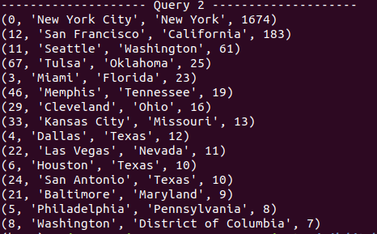

# Database Design
## DDL
```
CREATE TABLE City (
    CityID INT,
    CityName VARCHAR(100),
    StateName VARCHAR(50),
    StateAbbrev VARCHAR(2),
    Lat DECIMAL(8,6),
    Lng DECIMAL(9,6),
    PRIMARY KEY (CityID)
);

CREATE TABLE Route (
    RouteID INT,
    StartCityID INT,
    EndCityID INT,
    TravelTime_min REAL,
    PRIMARY KEY (RouteID),
    FOREIGN KEY (StartCityID) REFERENCES City(CityID),
    FOREIGN KEY (EndCityID) REFERENCES City(CityID)
);

CREATE TABLE Concert (
    ConcertID INT,
    CityID INT,
    ConcertName VARCHAR(100),
    Date VARCHAR(15),
    Time VARCHAR(10),
    Location VARCHAR(100),
    PRIMARY KEY (ConcertID),
    FOREIGN KEY (CityID) REFERENCES City(CityID)
);

CREATE TABLE Song (
    SongID INT,
    CityID INT,
    SongName VARCHAR(100),
    ArtistName VARCHAR(100),
    SpotifyID VARCHAR(30),
    Duration REAL,
    PRIMARY KEY (SongID),
    FOREIGN KEY (CityID) REFERENCES City(CityID)
);
```
## Data Tables 
[Songs](https://github.com/uiuc-fa21-cs411/sjkd/blob/main/tables/songtable.csv)
[Cities](https://github.com/uiuc-fa21-cs411/sjkd/blob/main/tables/citytable.csv)
[Routes](https://github.com/uiuc-fa21-cs411/sjkd/blob/main/tables/routetable.csv)
[Concerts](https://github.com/uiuc-fa21-cs411/sjkd/blob/main/tables/concerttable.csv)

## Advanced Query 1
<p align="center">

</p>

```
Query 1 EXPLAIN ANALYZE output without indexing:

[("-> Filter: (numConcerts >= 3)  (actual time=1.125..1.128 rows=14 loops=1)\n    
-> Table scan on <temporary>  (actual time=0.001..0.002 rows=14 loops=1)\n       
 -> Aggregate using temporary table  (actual time=1.124..1.125 rows=14 loops=1)\n           
 -> Nested loop inner join  (cost=159.75 rows=42) (actual time=0.084..0.965 rows=85 loops=1)\n               
 -> Filter: (Concert.`Date` like '%/2022')  (cost=115.65 rows=126) (actual time=0.063..0.583 rows=283 loops=1)\n                    
-> Table scan on Concert  (cost=115.65 rows=1134) (actual time=0.060..0.334 rows=1134 loops=1)\n                
-> Filter: (City.Lng > -90.000000)  (cost=0.25 rows=0) (actual time=0.001..0.001 rows=0 loops=283)\n                    
-> Single-row index lookup on City using PRIMARY (CityID=Concert.CityID)  (cost=0.25 rows=1) (actual time=0.001..0.001 rows=1 loops=283)\n",)]

Total time: 4.139 ms

```

## Advanced Query 2
<p align="center">

</p>

```
Query 2 EXPLAIN ANALYZE output without indexing:

('-> Sort: `count(Song.CityID)` DESC  (actual time=1.467..1.469 rows=15 loops=1)\n   
 -> Filter: (count(Song.CityID) >= 7)  (actual time=0.962..1.451 rows=15 loops=1)\n       
 -> Stream results  (cost=1189.55 rows=2156) (actual time=0.961..1.445 rows=43 loops=1)\n            -> Group aggregate: count(Song.CityID), count(Song.CityID)  (cost=1189.55 rows=2156) (actual time=0.956..1.422 rows=43 loops=1)\n                
-> Nested loop inner join  (cost=973.95 rows=2156) (actual time=0.088..1.231 rows=2156 loops=1)\n                    
-> Filter: (Song.CityID is not null)  (cost=219.35 rows=2156) (actual time=0.076..0.680 rows=2156 loops=1)\n                        
-> Index scan on Song using CityID  (cost=219.35 rows=2156) (actual time=0.074..0.561 rows=2156 loops=1)\n                    
-> Single-row index lookup on City using PRIMARY (CityID=Song.CityID)  (cost=0.25 rows=1) (actual time=0.000..0.000 rows=1 loops=2156)\n',)

Total time: 8.259
```

### Indexing
[Outputs and Analysis](https://docs.google.com/document/d/1H-vxBEzS4skHhmzbkW2LONUZ39-DrrFnIGNI5PnBo-A/edit?usp=sharing)

The four indexes we used for both queries were:

	CREATE INDEX city_name_index ON City (CityName(5)) USING BTREE;
	CREATE INDEX city_name_index ON City (CityName(5)) USING HASH;
	CREATE INDEX state_name_index ON City (StateName(5)) USING BTREE;
    CREATE INDEX state_name_index ON City (StateName(5)) USING HASH;

For both queries, we used only the first 5 elements because that was the most efficient way we could index on them without compromising accuracy. 
For the first query, we found that indexing on city names was marginally better with hash (3.889) than it was with b-tree (5.218), but the output with the hash indexing didn’t have much of an improvement compared to no indexing (4.139). We also found that indexing on state names was also very slightly better with hash (4.359) than it was with b-tree (4.732), and that there was no improvement from when no indexing was used, so it would probably be better not to use indexing at all for this query. 
	
For the second query, for the city names we found it was more efficient with hash (8.171) again than b-tree (8.511). Using hash is slightly better than it is without indexing (8.259), but the difference is very minimal. For state names, we actually found b-tree (8.258) to be more efficient than using hash (8.321), but there is no improvement compared to no indexing, so again it would probably be better not to use indexing at all for it. We also found that all the inefficiency on this is from the use of cityID, but since this is a primary key, there is no way we can easily index on this and therefore cannot gain much improvement. 

For both queries, we don’t see any significant improvement on efficiency with the indexes. The issue with both is that there are not any convenient columns to index on. We chose to index on the city and state because it is easy to identify them based on the first few characters, so it would be easier for us to read and understand the outputs. We also specifically chose city_name and state_name because they are not primary keys, and we can’t index on a primary key. 
