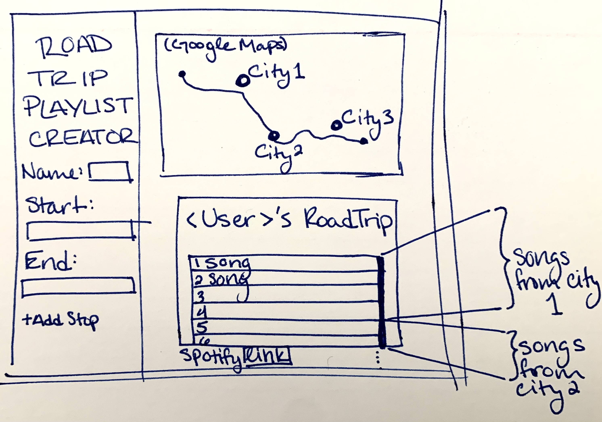

# Road Trip Playlist
## Description
&nbsp;&nbsp;&nbsp; Road trips are enhanced by the type of music played. It can also be an excellent opportunity to discover new music. We hope that our project will help people enjoy the road trip experience more by feeling more connected to the culture of every stop on the way to their destination. 

&nbsp;&nbsp;&nbsp; We plan to keep our UI simple. When a user first visits our website, they will enter the start and end location of their road trip. Our algorithm will pick a few major cities on their route and generate a Spotify playlist composed of the most popular songs from these cities.

&nbsp;&nbsp;&nbsp; The goal is to time the songs such that the user is listening to songs from a specific city as they pass that city. If we accomplish our MVP, we plan to queue songs directly instead of creating a playlist as we can better control their music based on their geographical location.

## Usefulness
&nbsp;&nbsp;&nbsp; Our project will provide the user with a playlist that allows them to experience the culture of the cities they are passing through.  Spotify and other websites have ways to create playlists about different cities, but they are limited to one city at a time. Our playlist made is customized to the user and their trip they are about to go on.

## Realness
&nbsp;&nbsp;&nbsp; The Spotify API will help us create our database on popular songs based on major cities and create a playlist.  The Google Maps API will allow us to get the road trip route & the data of major cities it passes through.

## Functionality Description
&nbsp;&nbsp;&nbsp; On our, developer end, the database will store a list of songs by the city they are popular in and then by popularity, and when locations are inputted, we will find the route between locations, develop a list of songs for each city along the route, and put them in a playlist.
&nbsp;&nbsp;&nbsp; On the user end, this should be a website they can go to, input their start and end locations, and then view the route created and a customized spotify playlist for their trip. It should look somewhat similar to this:

&nbsp;&nbsp;&nbsp; A creative piece to add to the user experience could be to highlight which cities we pulled songs from along their route both on the map or in the list of songs.  Another fun component could be including the user’s name in the playlist or having the user sign in to spotify so we could add the playlist to their account.

## Project Distribution
- Person 1: Google Maps API (Katie)
  - Get route with user's start and stop location
  - Find major cities along route
- Person 2: Spotify API (Sid)
  - Get songs from each city
  - Creating a playlist
- Person 3: Website (Deeya)
  - Creating the UI
  - Designing the website
- Person 4: Pressing Matters (Holly)
  - Helping with each of the three other tasks
  - Incorporating the API work with the website